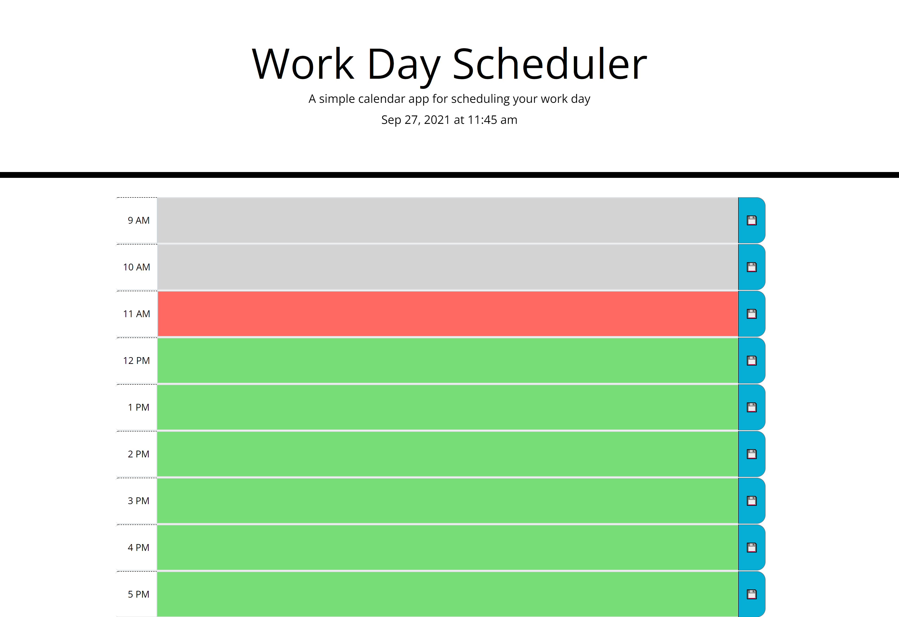

# Work-Day-Scheduler

 My personal objective in regard to this project was to add functioning javascript to a page with html and css already provided. In this case my goal was to create a simple day planner that would present the current date with a functioning clock and snippets of the page divided into hour long sections with each section capable of storing that days event data in local storage. Each hour-long snippet would also be color coded depending on the present hour.

I started by creating variables holding the hour snippet elements of the html page and storing them in an array. Moment.js was then used in a setInterval function to present the time, and later in a for loop to add different css classes based on passing time. Finally, a small series of loops was added to integrate local storage.

 The time spent on the project helped me obtain a level of comfort with using moment.js and reinforced my concepts regarding local storage

 
 

## Click the links below to access the page and repository respectively.
 

 - [Work-Day-Scheduler-Page](https://andis90.github.io/Work-Day-Scheduler/)
 

- [Work-Day-Scheduler Repository](https://github.com/AndiS90/Work-Day-Scheduler/)
 

 

## **Credits**
 
 

### [License](./assets/License.txt)

 

